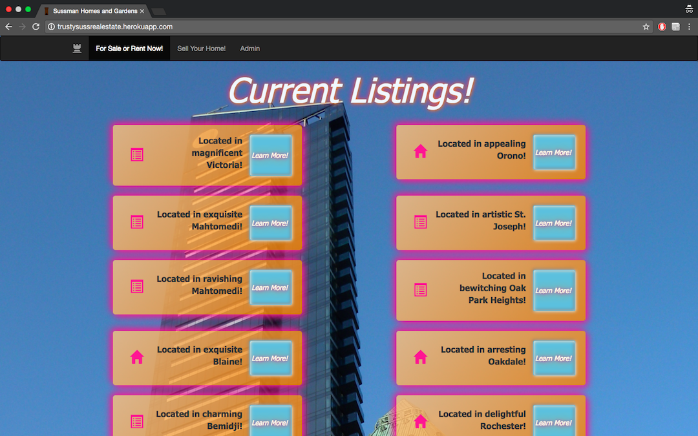
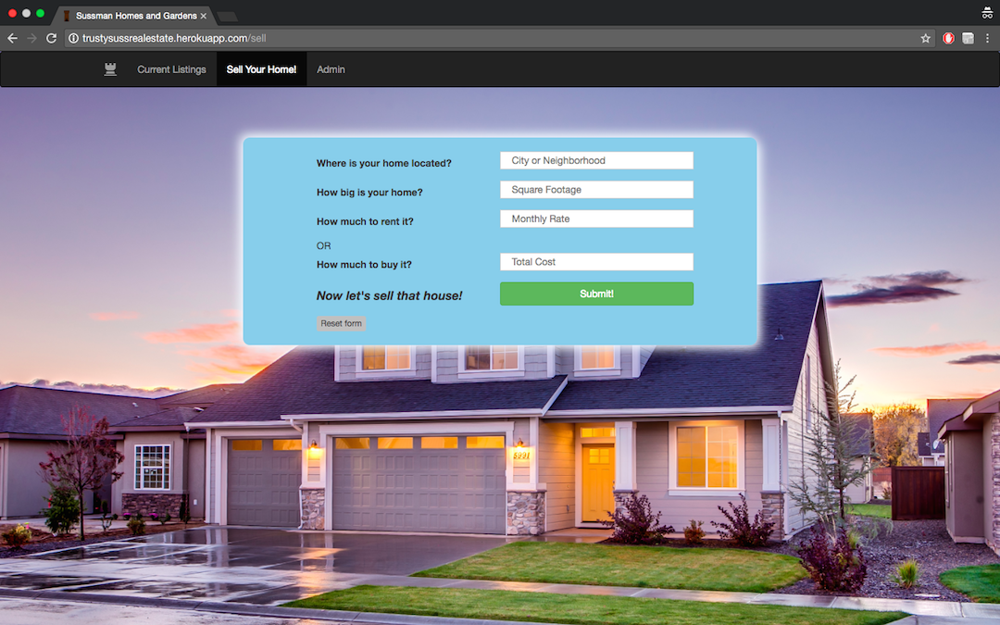
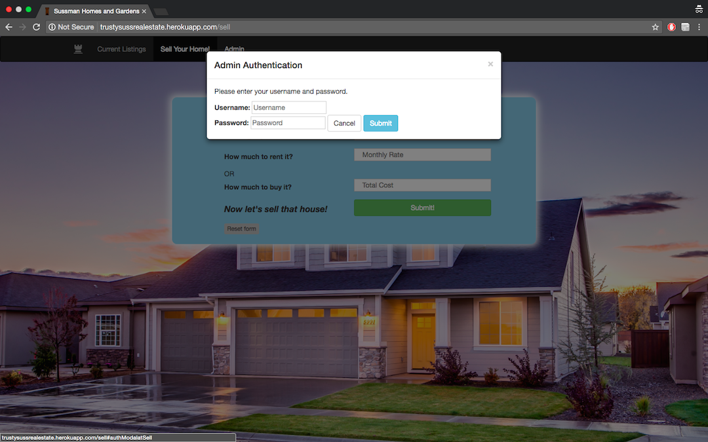
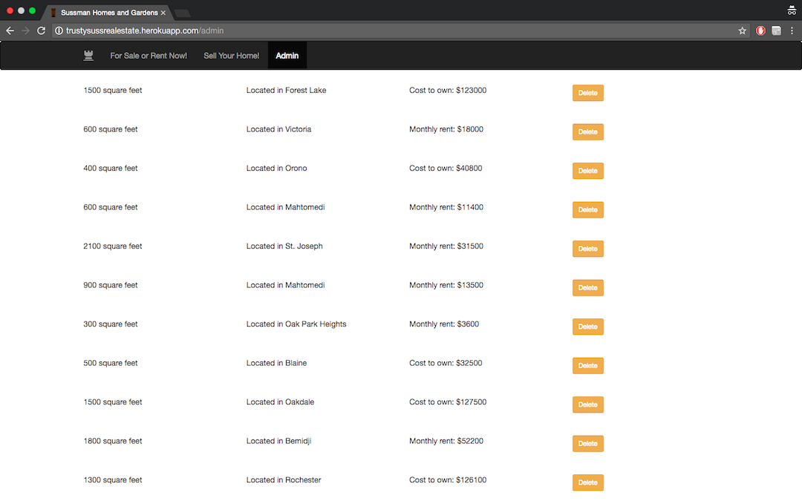

# Trusty Suss® Real Estate

Y Paul Sussman: April 03rd, 2017; Version 1.0

## Application Overview
This was our fourth Prime Weekend Challenge; here, I used node.js and express.js to query MondgoDB for on-the-market (well, "on-the-market") real estate. I then used jQuery and Bootstrap to create three user pages: one for buyers, one for sellers, and one for the agents.

## Getting Started
Fork, clone, or download the project, then run `npm install`.

In the `app.js` file, you'll need to replace the `mongoURI` string with the URI for your own database. You can then populate that database with the contents of `listingData.js`.

## Built With
* HTML 5, CSS 3, Bootstrap, alertify.js, and jQuery;
* Node.js, Express.js, and MondgoDB; and
* Heroku and mLab for hosting.

## Learning Value
Firstly, I'd like to apologize to all visitors for the orange and pink drop-shadows across the buyers page: I got into a discussion with a colleague about how to make the most effervescently untrustworthy sales site, and by the time the CSS had settled… it was already too late.

This was my first chance to really run free with exploring the uses of a NoSQL database, and at a stage where I had become quite comfortable with jQuery... so, naturally, I spent much of the weekend wrestling with Bootstrap. Sigh. (Not to let styling worm its way to the front of your project timeline is, I suppose, a valuable lesson in itself.)

I did learn much more of Bootstrap's functionality in this project, especially its JavaScript features like modals and popovers. Having become familiar with SweetAlert2 in the week prior, and thus wanting to explore a different alerts library, I found it very useful practice to sift through and evaluate the various available vendor options.

This project also provided my first opportunity for unguided deployment to remote servers (in the forms of a codebase, to Heroku; and a database, to mLab.) Finally, it was very useful to fully integrate a task-runner (here, Grunt) into a larger multi-day project. I'd been mildly resentful of the setup time required in the past; now, the value of its convenience became clear.

